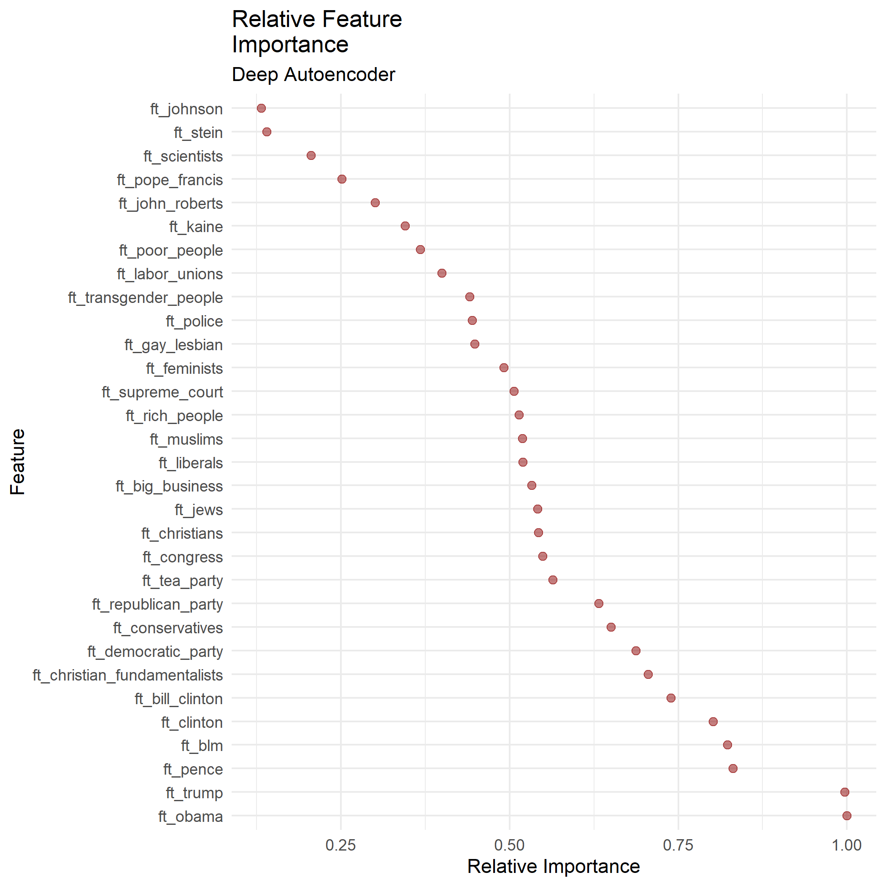
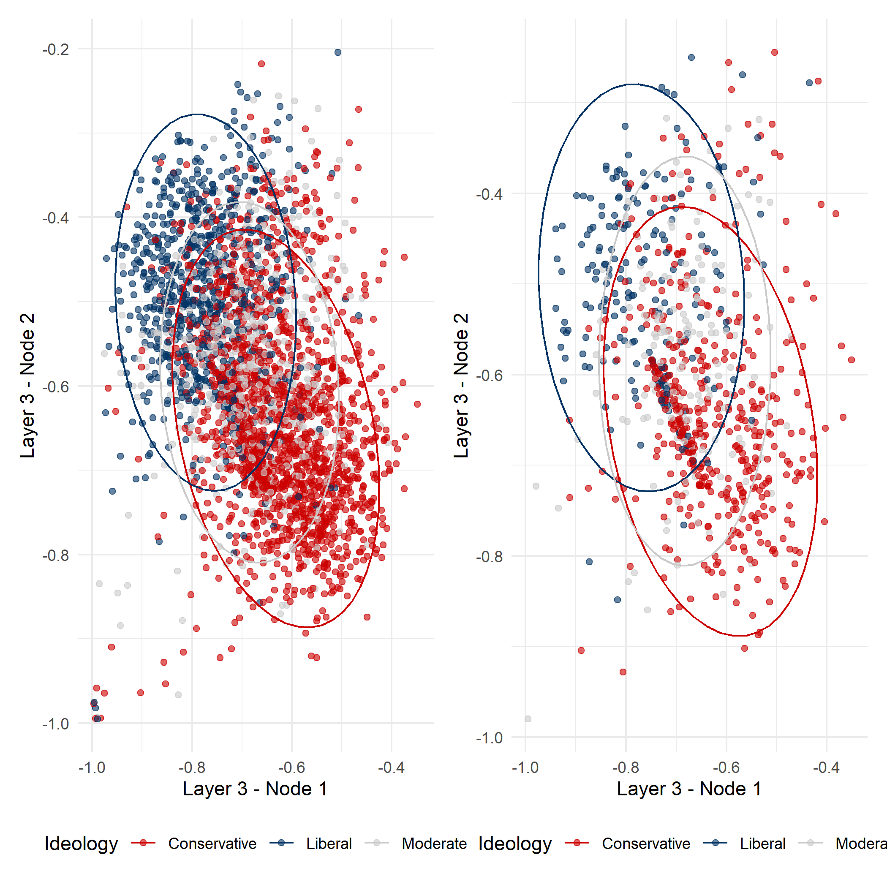
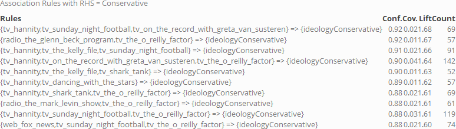
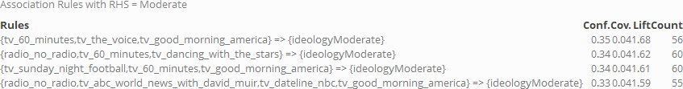
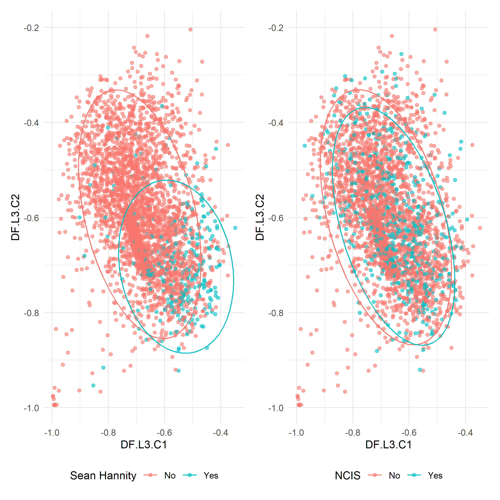

## Autoencoders

### Method

To further validate our results, we conducted a second analysis over the same dataspace using autoencoders for dimensionality reduction. To this end, we first trained an autoencoder with three layers and a 8-8-2 architecture on a random subset consisting of 80% of observations of the ANES feeling-thermometer data. We then compared the overall distribution and degree of separation between training and test set. We chose our neural network architecture on the assumption that the feeling-thermometer space is likely hierarchically structured. The layered architecture accordingly allowed us to examine different levels of abstraction in order to infer candidate ideological dimensions underlying the data. The autoencoder was trained over 1000 epochs using a hyperbolic tangent activation function. Subsequently we conducted our analysis on the 2 dimensions of the autoencoder's third layer. 

To numerically guide our exploration of the autoencoder embeddings, we deployed association rule mining on the media space. In this way, we obtained promising combinations of media items allowing us to extend our analysis beyond the inspection of single formats.

### Initial Analysis

Inspecting relative feature importance, we see that feelings towards certain politicians play the most significant role in determining the structure of the autoencoder space. Among these are former presidents Obama and Trump as well as presidential candidate Hillary Clinton. In addition, feelings towards the Republican and Democrat party as well as the Black Lives Matter movement seem to explain a large portion of the variation in the reduced dataspace. Feelings towards groups associated with particular sociopolitical discourses such as transgender people, feminists, Muslims and Christians score in the mid-range of feature importance while less popular politicians such as chief justice John Roberts seem to contribute little in reconstructing the input space. As the feature importance, at first glance, seems to correlate with the degree of media coverage the respective persons and groups receive, it seems likely to find media consumption reflected in the reduced dataspace of our autoencoder.

Just as in the plots obtained in the LLE analysis, we can see similar degrees of separation in terms of ideology as well as party affiliation with moderates again slightly more dispersed than liberals and conservatives and an analogous tendency regarding the partisan aspect. Comparing training and validation set, we obtained a similar picture with respect to the spatial distribution of ideology and party, lending additional face validity to our previous results. In the sparse plot of the validation set, we can easily see that the three ideological leanings are not equally represented in our dataset. Only about 20% of the respondents are self-reported moderates, whereas the bulk of observations (about 55%) represents the ideologically conservative part of the electorate. This numerical difference could put as at a disadvantage when examining smaller subsets of the data, such as particular combinations of media consumption. This will become apparent in the next phase of our analysis.

### Combination of Media Items

In a next step, we conducted association rule mining on the media space to guide our exploration of the autoencoder embeddings, restricting the consequent of each rule to be either party affiliation or self-reported ideology associated with each observation. Association rules are derived from the domain of market basket analysis and provide, among other features, a numerical measure for the confidence in the co-occurrence of given binary variables. Commonly operating over large dataspaces, association rule mining aims at extracting interesting rules of the type *Item A* + *Item B* + … -> *Item C*, where interestingness is defined in terms of a prespecified performance metric. As a primary metric we chose the so-called lift value which designates improvement over a random choice model. Within the restricted set of rules, we inspected those with a lift higher than 1.5. A set of high-confidence association rules extracted in this way for a conservative consequent takes the following form:

{width=90%}

Interestingly, a search over moderate consequents yields less useful rules, indicated by considerably lower lift and confidence values. A confidence value of around 0.33 indicates that of all rules containing the antecedent, only 33% have moderate as a consequent. Given that only 894 of 4270 (about 20%) of the respondents self-reported moderate as their ideology, this still seems like an improvement over a random choice model.

{width=90%}

In our analysis we used association rules mainly to provide us with interesting but unintuitive combinations of consumed media associated with a given ideology or party affiliation. This idea is illustrated in the figure below. Inspected in isolation, the viewership of the politically conservative TV show *Hannity* clearly clusters in the ideologically conservative portion of the autoencoder space while *NCIS*, at face value an unpolitical entertainment format, is spread over its entire range.

In response to relatively higher confidence values of the association rule *Hannity* + *NCIS* -\> *Ideology: conservative* compared to *Hannity* alone as an antecedent, we once more surveyed the autoencoder space, this time coloring the intersection of *Hannity* and *NCIS* viewers. As expected, a number of outliers that cannot be unambiguously associated with the conservative portion of the autoencoder space cease to be part of the selection. This, however, comes at the cost of reducing the number of observations present in our visualization.

In order to probe the utility of intersections of different media items based on our intuitions about combinations of partisan media, we examined *Sean Hannity* and shows commonly associated with conservative ideology. As expected, the intersection of *Hannity*, *The O-Reilly Factor* and *On the Record with Greta Van Susteren* clearly picks out a cluster of observations in the conservative range of our dimension-reduced dataspace.

What is surprising, however, is the similarity between the combinations of three conservative shows and that of *Hannity* and a seemingly unpolitical entertainment format. Interestingly, the number of observations that fall into the intersection of the three political shows is visibly higher than that of *Hannity* and *NCIS*. It is plausible that the latter combination picks out a specific subset of conservative viewers. The nature of the distinction between the two groups other than a predilection for the crime genre, however, can only be surmised. A hypothetical ideological factor underlying this tendency could, for instance, be a positive attitude towards police authority.

  
