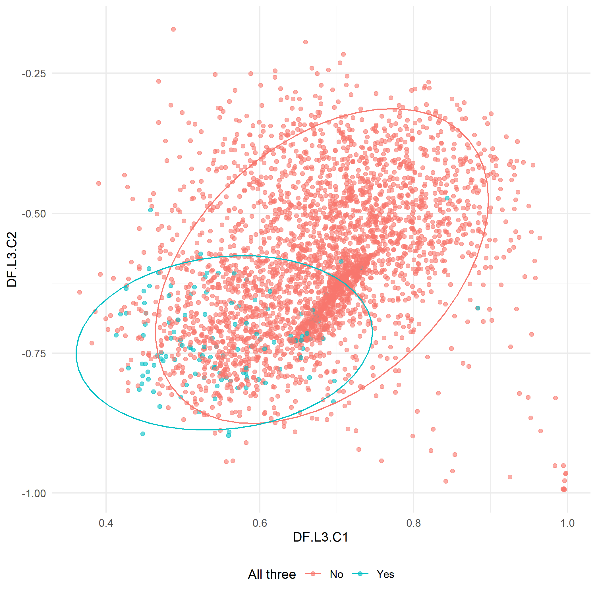

## Autoencoders

### Method

To further validate our results, we conducted a second analysis over the same dataspace using autoencoders for dimensionality reduction. To this end, we first trained an autoencoder with two hidden layers and 8 nodes each on a random subset consisting of 80% of observations of the ANES feeling-thermometer data. We then compared the overall distribution and degree of separation between training and test set. The autoencoder was trained over 1000 epochs using a hyperbolic tangent activation function. Subsequently we conducted our analysis on the 2 dimensions of the autoencoder's 2-node output layer. We chose our neural network architecture on the assumption that the feeling-thermometer space is likely hierarchically structured. The layered architecture accordingly allowed us to examine different levels of abstraction in order to infer candidate ideological dimensions underlying the data.

To numerically guide our exploration of the autoencoder embeddings, we deployed association rule mining on the media space. In this way, we obtained promising combinations of media items allowing us to extend our analysis beyond the inspection of single formats.

### Initial Analysis

Inspecting relative feature importance, we see that feelings towards certain politicians play the most significant role in determining the structure of the autoencoder space. Among these are former presidents Obama and Trump. In addition, feelings towards the Republican and Democrat party as well as the Black Lives Matter movement seem to explain a large portion of the variation in the reduced dataspace.

Just as in the plots obtained in the LLE analysis, we can see similar degrees of separation in terms of ideology as well as party affiliation with moderates again slightly more dispersed than liberals and conservatives and an analogous tendency regarding the partisan aspect.

Comparing training and testing set, we obtained a similar picture with respect to the spatial distribution of ideology and party, lending more face validity to our previous results.

### Combination of Media Items

In a next step, we conducted association rule mining on the media space to guide our exploration of the autoencoder embeddings, restricting the consequent of each rule to be either party affiliation or self-reported ideology associated with each observation. Within the restricted set of rules, we inspected those with a lift value higher than 1.5. for each ideology and party affiliation indicating a marked improvement over a random choice model.A set of high-confidence association rules extracted in this way for a conservative consequent takes the following shape:

{width=90%}

Interestingly, a search over moderate consequents yields less useful rules, indicated by considerably lower lift values:

{width=90%}

In our analysis we used association rules mainly to provide us with interesting but unintuitive combinations of consumed media associated with a given ideology or party affiliation. This idea is illustrated in the figure below. Inspected in isolation, the viewership of the politically conservative TV show *Hannity* clearly clusters in the ideologically conservative portion of the autoencoder space while *NCIS*, at face value an unpolitical entertainment format, is spread over its entire range.

In response to relatively higher confidence values of the association rule *Hannity* + *NCIS* -\> *Ideology: conservative* compared to *Hannity* alone as an antecedent, we once more surveyed the autoencoder space, this time coloring the intersection of *Hannity* and *NCIS* viewers. As expected, a number of outliers that cannot be unambiguously associated with the conservative portion of the autoencoder space cease to be part of the selection. This, however, comes at the cost of reducing the number of observations present in our visualization.

In order to probe the utility of intersections of different media items based on our intuitions about combinations of partisan media, we examined *Sean Hannity* and shows commonly associated with conservative ideology. As expected, the intersection of *Hannity*, *The O-Reilly Factor* and *On the Record with Greta Van Susteren* clearly picks out a cluster of observations in the conservative range of our dimension-reduced dataspace.

What is surprising, however, is the similarity between the combinations of three conservative shows and that of *Hannity* and a seemingly unpolitical entertainment format. It is possible that the two shows appeal to a subset of the population that 
